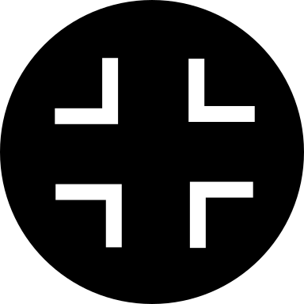
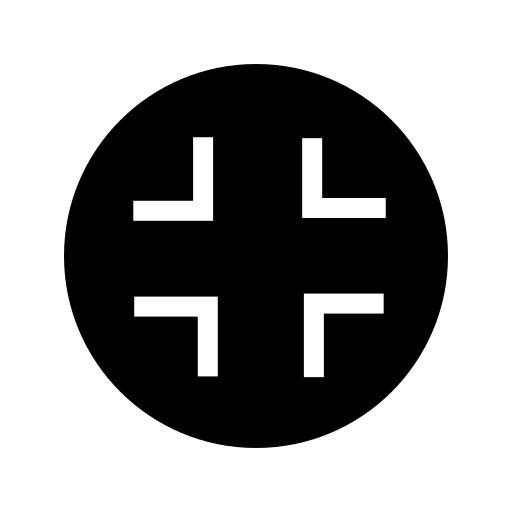
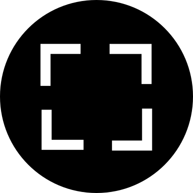
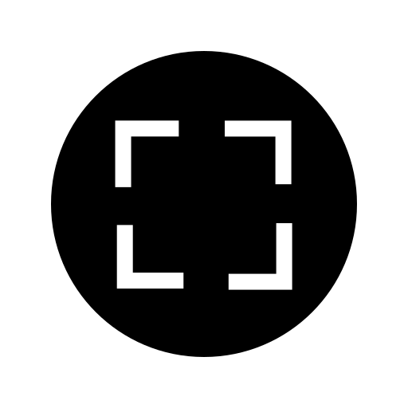
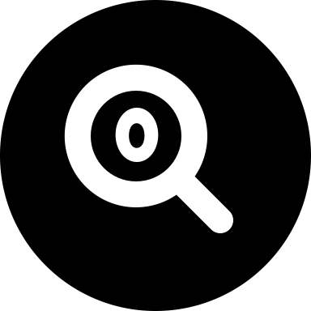
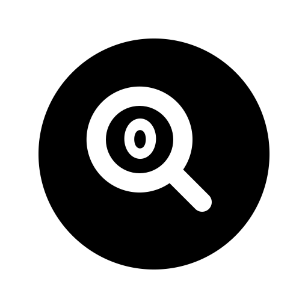

# Vivict-Icons

Icon library and font used by [vivictpp](https://github.com/vivictorg/vivictpp)

Some of the icons are completely or partially based on icons from [ionicons](https://github.com/ionic-team/ionicons)

## Icons

| Name | Image |
| --- | --- |
 | collapse-full.svg |  |
 | collapse.svg |  |
 | expand-full.svg |  |
 | expand.svg |  |
 | pause-circle-full.svg |  |
 | pause-circle.svg |  |
 | play-circle-full.svg |  |
 | play-circle.svg |  |
 | play-skip-back-circle-full.svg |  |
 | play-skip-back-circle.svg |  |
 | play-skip-forward-circle-full.svg |  |
 | play-skip-forward-circle.svg |  |
 | search-circle.svg |  |
 | zoom-in-full.svg |  |
 | zoom-in.svg |  |
 | zoom-out-full.svg |  |
 | zoom-out.svg |  |
 | zoom-reset-full.svg |  |
 | zoom-reset.svg |  |

## Font
The `vivict-icons.ttf` font contains the above icons mapped to codepoints 0xf000 to 0xf011.

# License
vivict-icons is licensed under the [MIT License](LICENSE)
